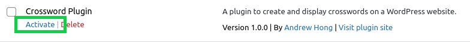
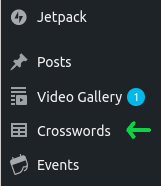
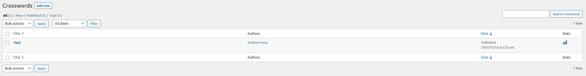
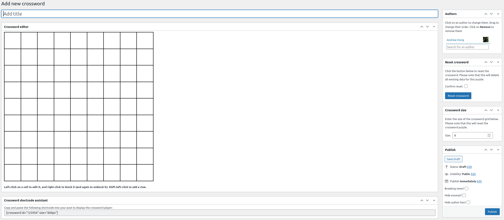

# Crossword Plugin

## Installation

Download the repository as a ZIP file, and copy it to your hosting provider. Unzip it, and copy the folder `src` to `wp-content/crossword-plugin`.
Then, activate the plugin in your WordPress installation.

## Usage

The first thing you will notice is that the plugin adds an item in your side navigation menu called 'Crosswords'.

Once you click in, you will see the following page:

You will be able to see your existing crosswords and a button that will allow you to create new puzzles. Move your mouse over a crossword puzzle in this view to show options (edit, delete).

## Editor

The editor page appears as follows:

Notice several elements:
- Title: The title of your puzzle
- Reset crossword puzzle: Clears your crossword puzzle
- Crossword synchronization status: To avoid potential JS conflicts, the actual crossword designer is shown through an iframe. Because of that, the main post editor needs to synchronize the data from the iframe, hence the last time a successful sync has occurred is shown. If this says "Never", do not save the post.
- Crossword size: Change the number of squares on both axes of the grid
- Crossword shortcode assistant: Copy this shortcode to display the puzzle on a post.

The actual crossword editor is fairly simple to use; left click to change a square, right click to block it off (i.e., black square) and again if you want to undo it, and lastly hold shift and left-click on a square to add a hint number.
